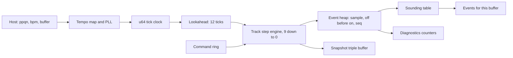

# SPEC-0001 tech spec

Revision r1. Approved by `@beaudesign` on 2026-09-29 for phases F0 and F1 (see
`README.md`). The clock rewrite (O4) is high tier and needs its own approval and a
release plan. The ring and snapshot (O6) need Q6 confirmed first.

## Current design

`render` advances an f64 tick clock. For each 192 PPQN tick, `step_all_tracks` copies the
active `Page`, then steps tracks 9 down to 0. Notes go into a 512-slot unsorted array
keyed by absolute sample time. Each buffer scans that array repeatedly for the earliest
due event, emits up to 256, and clamps `at_sample` into the buffer window.

## Proposed change

- **Clock (O2, O4).** u64 tick position. Sample time is derived per tempo segment, never
  accumulated. O2 alone only resyncs the clock on the Play transition.
- **Lookahead (O3).** Process ticks up to `MAX_EARLY_TICKS` past the buffer end. Emit only
  events inside the window.
- **Event heap (O10).** Fixed-capacity binary heap ordered by (sample, off before on,
  insertion sequence). Capacity 1024, no allocation.
- **Sounding table (O1, O5).** 4 KB table that powers the stop flush, forced offs and
  overlap handling.
- **Diagnostics (O5).** Counters exposed by FFI and the snapshot.
- **Ring and snapshot (O6).** Wait-free, plain data, no dependencies unless Q6 says
  otherwise.
- **Runner (O7).** `octorun` binary over the same engine, deterministic output, optional
  live MIDI feature.

## Affected files, interfaces and data

| Area | Files | Change |
|---|---|---|
| Engine | `octocore/src/engine.rs`, new `sounding.rs`, `queue.rs`, `ring.rs`, `snapshot.rs` | O1 to O6, O10 |
| Types | `octocore/src/types.rs` | Append `PitchBend` and `ChannelPressure` to `Event`. Add `Diagnostics`. `HostTransport` semantics become real. |
| FFI | `octoffi/src/lib.rs`, `octoffi.h` | Additive: diagnostics getter, ring push, snapshot read, `OCTOFFI_ABI_VERSION`. No existing signature changes. |
| Tests | `octocore/src/fixture.rs`, `tests/invariants.rs`, `tests/conformance/**` | DSL v2, metamorphic suite, new fixtures |
| Runner | new `crates/octorun` | Binary, patterns, golden hashes |
| Harness | `justfile`, `harness/`, `.github/`, new `xtask` crate | O8 |
| Data | none | No persistence format exists yet, so there is nothing to migrate. |

## Compatibility, migration and rollback

No shipped consumer exists (the Swift side is not built), so FFI changes are additive and
cost nothing to adopt. Behaviour changes to emitted MIDI (O1, O2, O3, O10) are fixes, each
with a failing test first. Rollback is a revert of the single commit. The tick clock
rewrite (O4) lands as its own pull request behind the high-tier approval.

## Test plan and monitoring

- Each opportunity lists its assertion in `findings.md`. Each new test must fail on
  `6ef921f` and pass after the fix. The pull request shows both runs.
- A synthetic-clock soak: 30 minutes at 120 BPM is 691,200 ticks, which runs in seconds
  without a real host. It backs `verify:timing:deep`.
- Runtime signals: the diagnostics counters and a jitter histogram from the null host.
- Ring and snapshot: Miri or loom, plus a two-thread soak.

## Known risks

- The manual may be silent on retrigger and stop behaviour. Choices go in
  `AMBIGUITIES.md` with both readings (Q5).
- Lookahead delays command effects by up to 31 ms at 120 BPM. Musically under one step, but
  a visible change.
- A hand-rolled ring is a classic place for subtle bugs. The loom test is mandatory.
- Timings are from a cloud container. Repeat the stress benchmark on an M-series machine
  before quoting numbers.

## Alternatives considered

| Choice | Options | Pick and reason |
|---|---|---|
| Early events (O3) | Clamp (today), fixed output latency with plugin delay compensation, lookahead | Lookahead. Clamp is the bug. Fixed latency adds a permanent delay the host must compensate. |
| Event queue (O10) | Linear scan (today), sorted array, binary heap | Binary heap for stable, provable ordering. The speed gain is not the reason. |
| Clock (O4) | f64 accumulation (today), u64 ticks with derived sample time | u64 ticks. It matches `docs/02` and removes drift by construction. |
| Command ring (O6) | crossbeam `ArrayQueue` (as `docs/02` says), hand-rolled | Hand-rolled, tested with loom, to keep the core dependency-free. Open in Q6. |
| Report generator (O8) | Shell plus jq, Python, `cargo xtask` | `cargo xtask`: same toolchain, testable, no new language. |

## Plan

Phases end on exit criteria, not dates, matching `docs/09`. This finishes Phase 0 for the
core-only slice, since `STATE.md` says Phase 0 exit criteria are not met.

| Phase | Scope | Exit criteria | Kill or rescope |
|---|---|---|---|
| F0 Real ratchet | O8, DSL v2 basics (O9), O1 and O2 as the pilot | Tri-state verify writes valid report JSON. CI and CODEOWNERS present. `verify:regressions` enforces the baseline. O1 and O2 tests fail on `6ef921f` and pass after. | If the DSL cannot express the invariants, use Rust integration tests instead. |
| F1 Deterministic and observable | O3, O5, O10, O7, metamorphic suite | Buffer invariance holds at 8 sizes plus variable. 5 golden event hashes. Diagnostics visible over FFI. `just run` works headless. WASM demo plays. | If lookahead makes edits feel late in the demo, test the fixed-latency alternative. |
| F2 Locked to the host | O4, O6 | Analytic jitter sigma at most 120 us, max at most 500 us at every buffer size. Ramp drift at most 1 sample. Ring and snapshot pass loom and a two-thread soak. | If the PLL cannot meet sigma under variable buffers, ship fixed-latency mode and log an ADR. |
| F3 The corpus | Two-key fixture mining, mutation gate | At least 100 fixtures, one per manual section first. Mutation score baselined and ratcheted. | If fewer than 40% of disagreements convert to fixtures, tighten the process before scaling. |

## Frontier ideas (not commitments)

1. Two-key fixtures: two agents transcribe a fixture from the same manual page blind.
   Agreement becomes a fixture, disagreement becomes an `AMBIGUITIES.md` entry.
2. Metamorphic gates first: buffer-size, stop/play idempotence, tempo scale, seed replay.
3. Replay files as bug reports: seed plus command log plus host clock trace, in NDJSON.
4. Mutation score as the anti-gaming ratchet, automating the spot-audit in `docs/07`.
5. The WASM lane: WebMIDI plus the WebAudio clock, and a fast headless loop in Node.
6. Risk-routed model tiers with a cost ledger, cheap models behind deterministic checks.
7. Gate-driven backlog: every stub gate and every open `AMBIGUITIES.md` item is a task.
